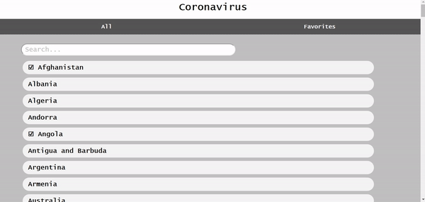

# COVID

Single page Coronavirus tracking application built using vanilla javascript.



[http://nolancassidy.com/covid19](http://nolancassidy.com/covid19)

Note: If data is not appearing it is because to many requests have been made to the COVID19 API. Please wait a second and try the action again.

## Features

* COVID19 API Calls
* List View of all Countries
* Search Filter
* Single Detailed View
* Local Favorite Storage
* Favorite Tab View
* Testing with Jest

## Getting Started

1. download/clone the github repo

2. install
```
npm install
```

3. start application
```
npm start
```

4. Project can now be viewed at http://localhost:8080/

## Running the tests

Testing is run using Jest.

```
npm test
```

## File Structure

/css and /js - are only used for hosting on my github pages
/examples - videos and gifs of working examples
/public - contains the js and css file for running on local hosting
index.html is main html File
index.js is files used for starting applicaion with npm
test.test.js is the jest testing file

## Authors

* **[Nolan Cassidy](https://github.com/NolanCassidy)** - *Creator*
